# From Source Code to Test Cases: A Comprehensive Benchmark for Resource Leak Detection in Android Apps

Our benchmark is the result of a qualitative work based on the reproduction of resource leaks already reported in other datasets and papers. Our work focused on the compilation, execution and reproduction of failures. This significant manual effort resulted in the definition of a benchmark that others can easily use to reproduce faillures and to study static and dynamic analysis techniques for resource leak discovery, debugging and fixing.

The benchmark includes apps affected by resource leak, their source code and apk, a reference to the bug reports and commits about the problem, and a test case to reproduce the leak automatically. We exemplify below how to use the benchmark.

In order to study the use of the benchmark, we ask you to provide some information at [https://goo.gl/forms/JZWWaeOK5TMbkacA2](https://goo.gl/forms/JZWWaeOK5TMbkacA2). 

Please feel free to [contact Oliviero Riganelli](http://www.lta.disco.unimib.it/riganelli/), if you have any questions.

## Contributors

* [Oliviero Riganelli](http://www.lta.disco.unimib.it/riganelli/) 
* [Daniela Micucci](http://www.sal.disco.unimib.it/people/daniela-micucci/)
* [Leonardo Mariani](http://www.lta.disco.unimib.it/lta/personalPages/leonardoMariani/leonardoMariani.php)

## Publications

O. Riganelli, D. Micucci, L. Mariani, "From source code to test cases: A comprehensive benchmark for resource leak detection in Android apps" In Software: Practice and Experience 2018;1–9. https://doi.org/10.1002/spe.2672

O. Riganelli, D. Micucci and L. Mariani, "Policy Enforcement with Proactive Libraries" In Proc. of 12th International Symposium on Software Engineering for Adaptive and Self-Managing Systems (SEAMS), Buenos Aires, Argentina, 2017, pp. 182-192. https://doi.org/10.1109/SEAMS.2017.9

O. Riganelli, D. Micucci, L. Mariani, Y. Falcone, "Verifying policy enforcers" In Proc. of of the 17th International Conference on Runtime Verification (RV), Seattle, Washington, USA, 2017, pp. 241-258, https://doi.org/10.1007/978-3-319-67531-2_15

## Related Datasets

[Benchmark for Data Loss errors in Android Apps](https://gitlab.com/learnERC/DataLossRepository)

## Requirements
1. If not already present, install:
	* [Andorid SDK](https://developer.android.com/) 
	* [Appium](http://appium.io), [Eclipse](http://www.eclipse.org/downloads/) for test case execution
	* [Android Studio](https://developer.android.com/studio/) or [Eclipse with AD](https://marketplace.eclipse.org/content/android-development-tools-eclipse), only if you want to re-compile and debug apps
	* An Android device or emulator like [Genymotion](https://www.genymotion.com/fun-zone/) to run apps

2. Set "ANDROID_HOME" and "adb" in the environment variables.

## How to Reproduce a Resource Leak

1) Open the file *Android\_App\_Leaks.htm* to see a tabular representation of the information and artifacts produced for each resource leak, as shown below. 
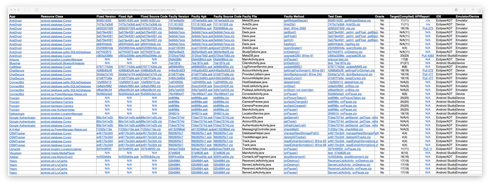

2) The first column, *App*, contains a reference to the software project to which the resource leak is related. For example, by clicking on [AnkiDroid](https://github.com/ankidroid/Anki-Android) you will open the following GitHub page.

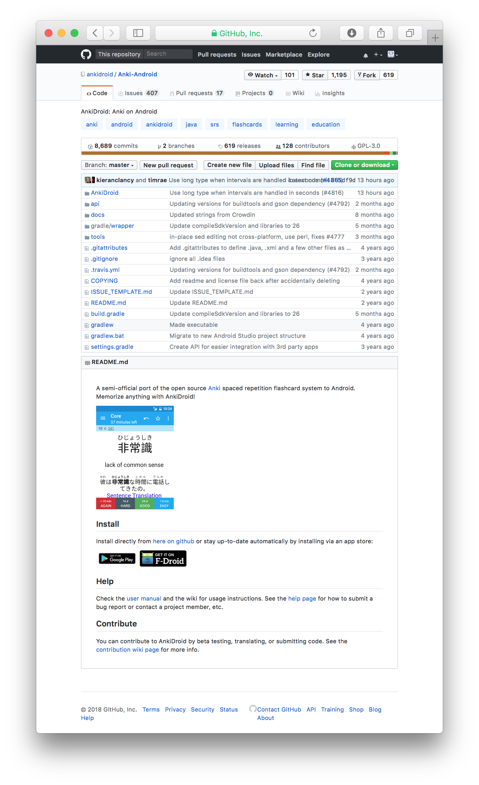

3) The second column, *Resource class*, shows the Android API class that identifies the resource that is leaked. For example, by  clicking on [SQLiteDatabase](https://developer.android.com/reference/android/database/sqlite/SQLiteDatabase), you will see the following Android documentation for the *SQLiteDatabase class*.

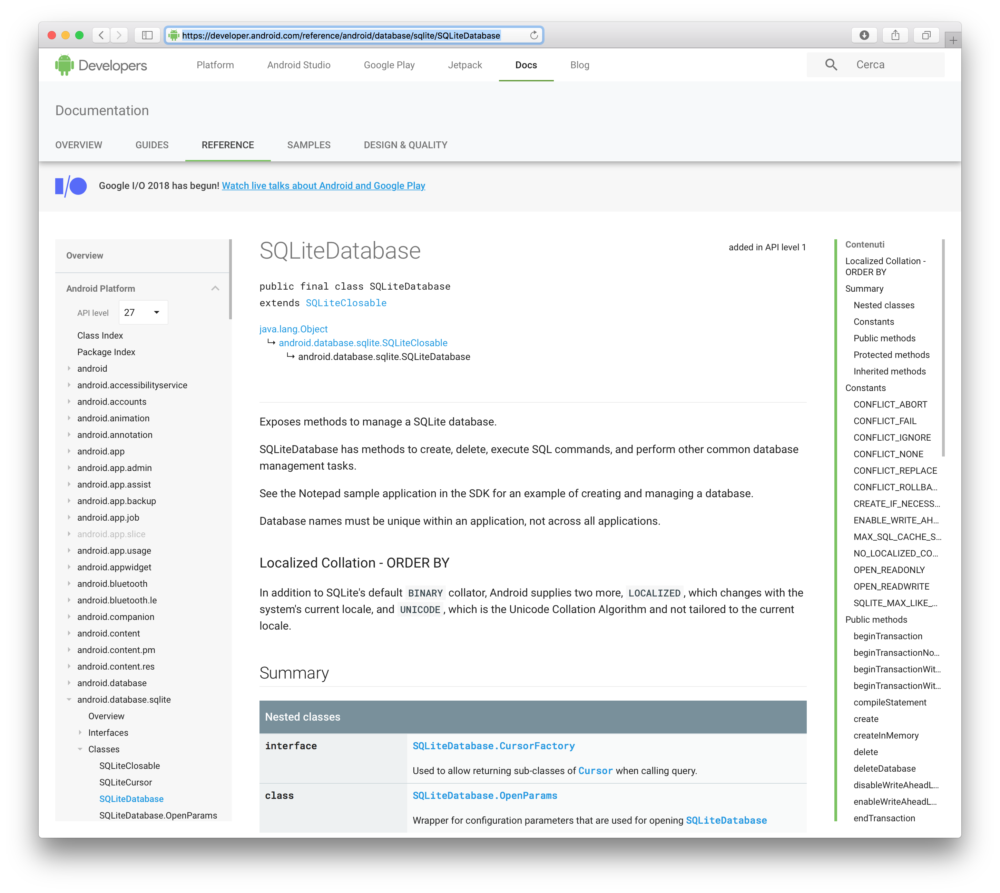

4) The third column, *Fixed Version*, refers to the version of the app in which the resource leak has been fixed. For example, by clicking on [b27f423f73](https://github.com/ankidroid/Anki-Android/commit/b27f423f73a7e940b31fae3dce8722c0866abca0) you will see the fix commit, as shown below.

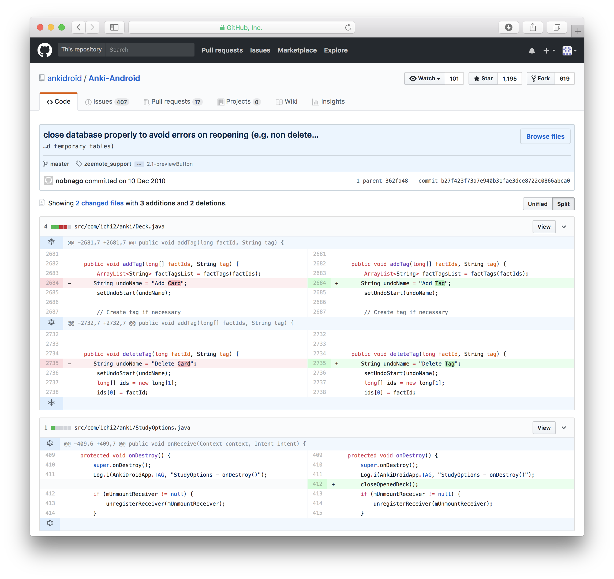

5) The *Fixed APK* column is a link to the APK of the fixed version of the app, that you can install for example using the *adb install* command as shown below.

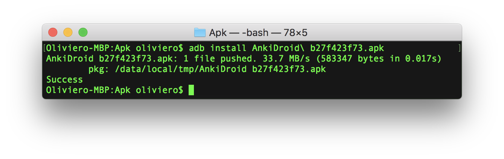

6) The *Fixed Source Code* column shows a link to the zip file containing a copy of the project sources with the fix.  The contents of the zip file were used to build the APK.

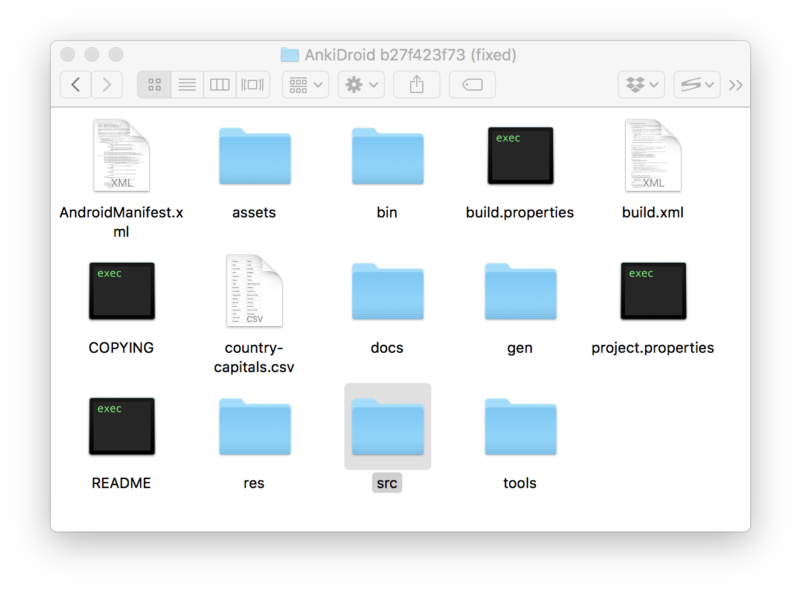

7) The *Fixed Source* column shows a link to the zip file containing a copy of the project sources with the fix.  The content of the zip file has been used to build the APK.

8) Similar to the version with the fix, by clikcing on the item in the *Faulty version* column you will reach the faulty version of the app in its version control system.

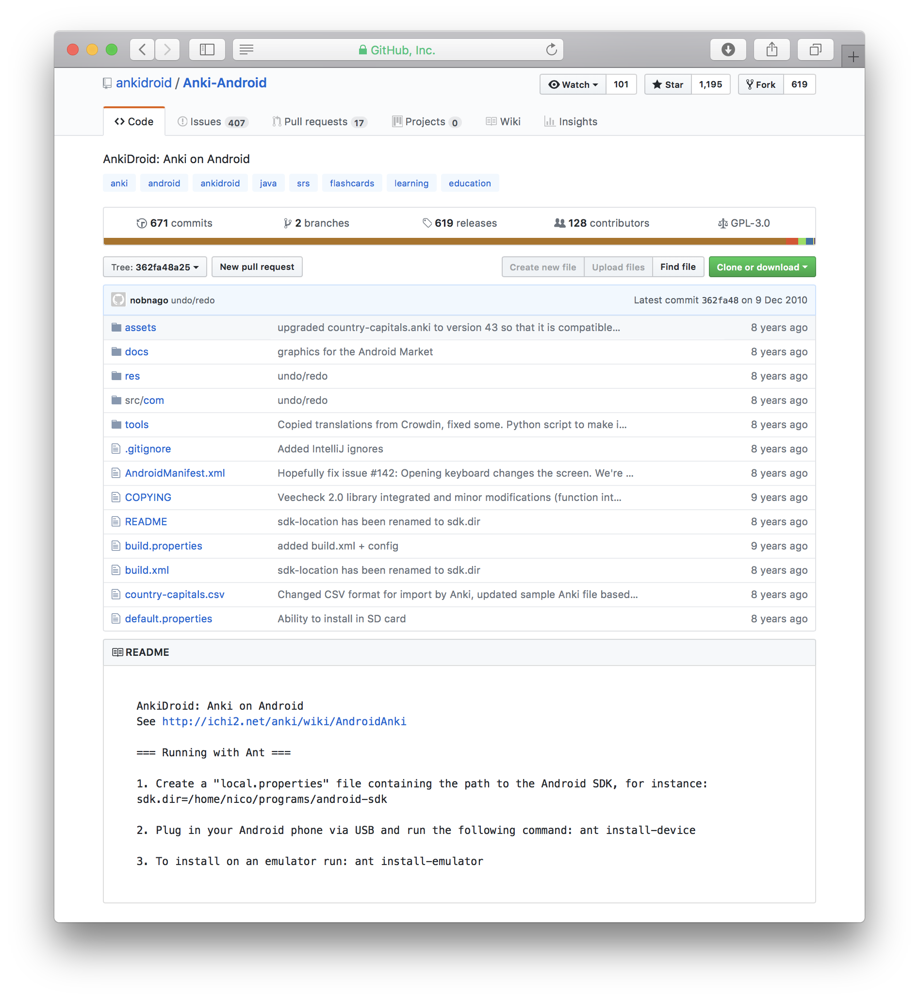

9) The column *Faulty APK* stores a link to the apk file of the faulty app.

10) The *Faulty Source Code* column stores a link to the zip file containing the source code of the faulty version of the app that is available in our benchmark under the folder of the app used to build the APK.

11) The *Faulty file* is the name of the file with the class that misses to invoke the release method, while the *Faulty method* is the name of the method in the *Faulty file* which misses to release the leaked resource. Clicking on the latter item opens the file in the version control system of the app as shown below.

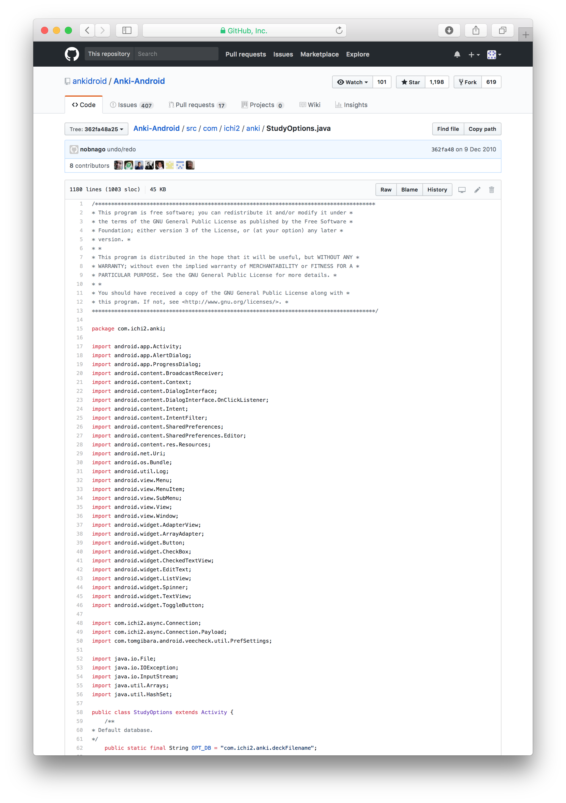
 12) The *Test case* column stores a link to the zip file that contains an Appium automatic test case that can be executed to reveal the resource leak. The automatic test is available in our benchmark under the folder of the app. To run the test case it is necessary to configure and run the Appium server. The server must run locally, its address must be 127.0.0.1 and its port 4723 (If it is not the case, the test case must be changed accordingly). To run it, it is enough to click on the Start Server button inside the Appium Desktop as shown below ([more info about Appium](https://appium.io/docs/en/about-appium/getting-started/?lang=en#running-your-first-test)). 
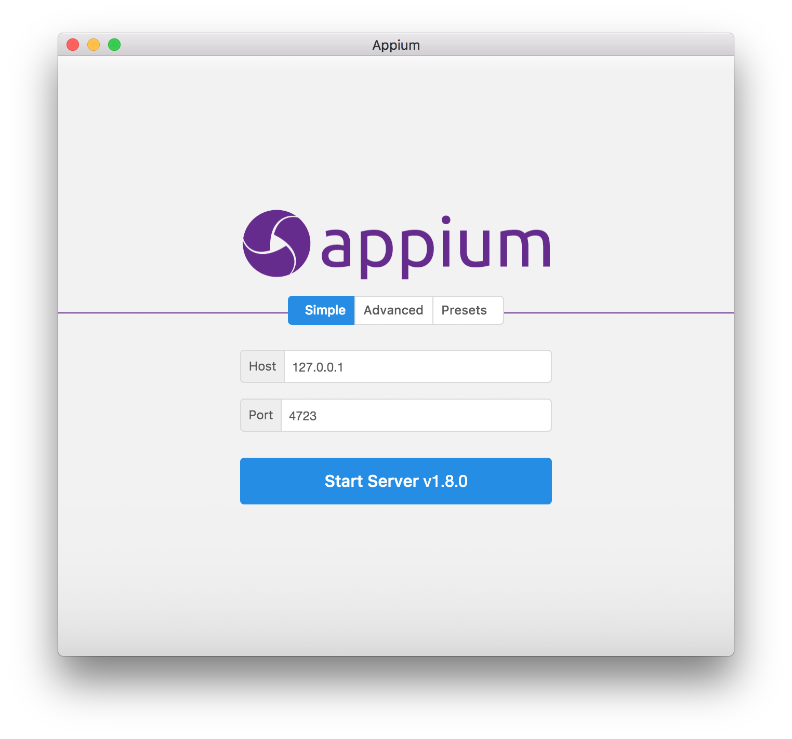

If the server is running you should see the following window.

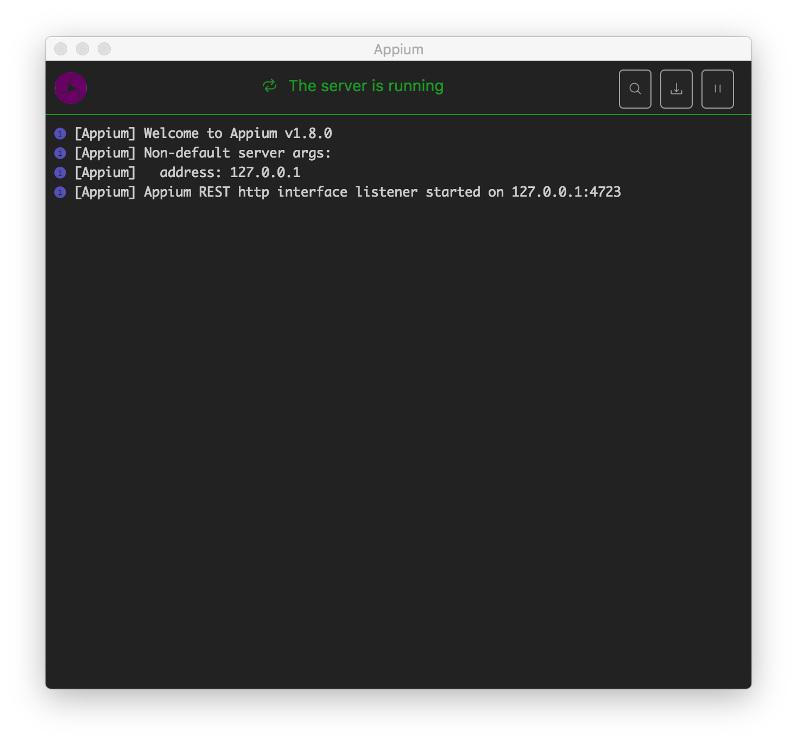

Then you have to install the APK you want to test. For example we install the APK *AnkiDroid 362fa48a25.apk* affected by a resource leak:

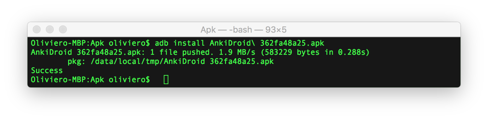

Then you have to unzip the file containing the test case project:

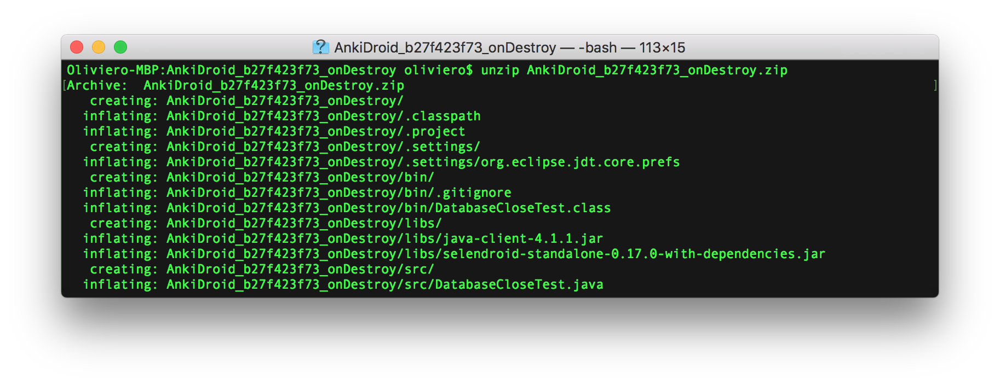

The project can be opened in Eclipse IDE (alternatively, you can compile it and run it from the command line):

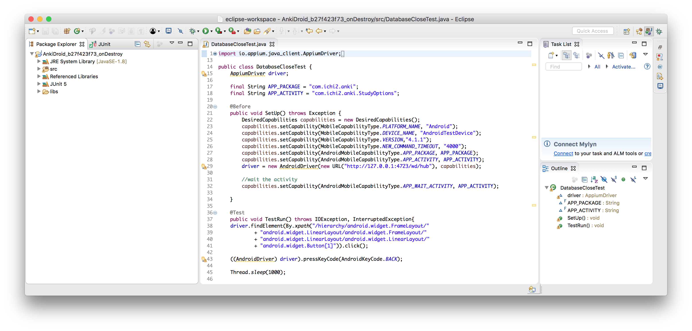

The test case must be run as a JUnit Test.

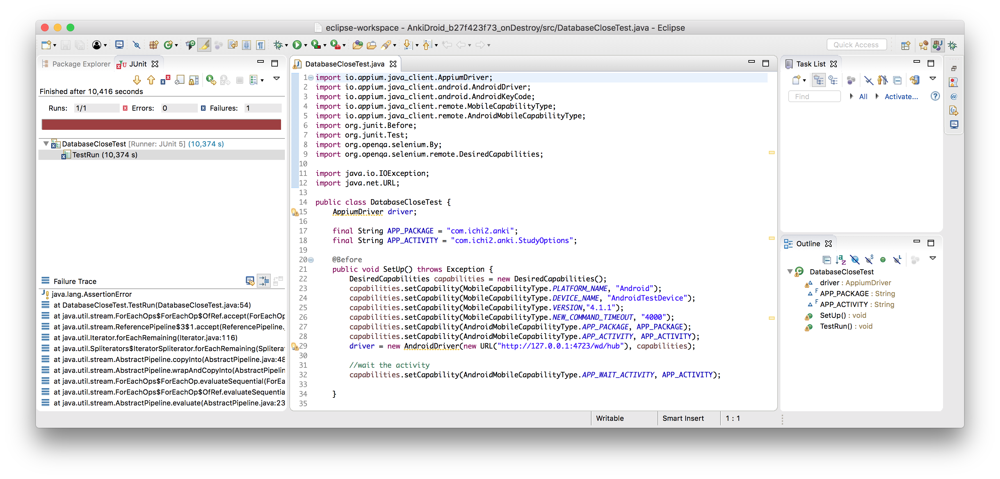

If desired, you can perform the same test case on the version with the fix. To do this, uninstall the version with the fault and install the version with the fix (e.g. AnkiDroid b27f423f73.apk):

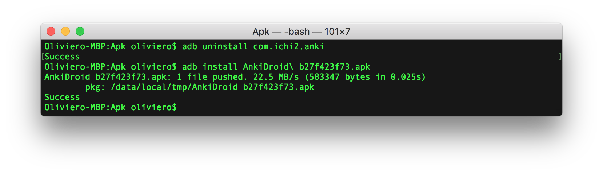

Then rerun the same test case:

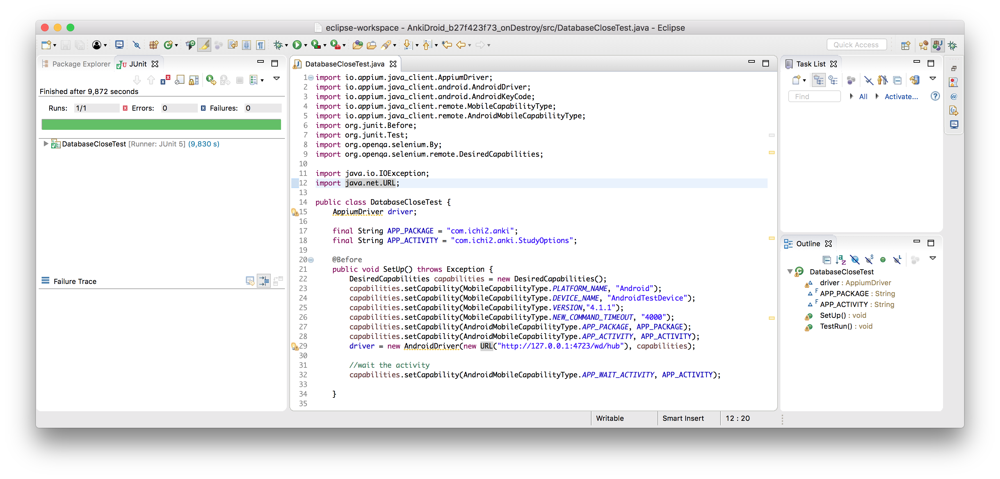

 
13) *Target (Compiled) API* is the version of the Android API declared as target in the manifest file and the version of the Android API that we used to reproduce the failure, respectively.

14) *IDE* is the Android IDE that we used to compile and debug the app.

15) The *Emulator/Device* column indicates whether the emulator is sufficient to reproduce the failure, or a real device is required.

16) *Oracle* indicates if the test case includes an oracle.

## License

The projects referenced in the Benchmark are subject to their respective licenses.
